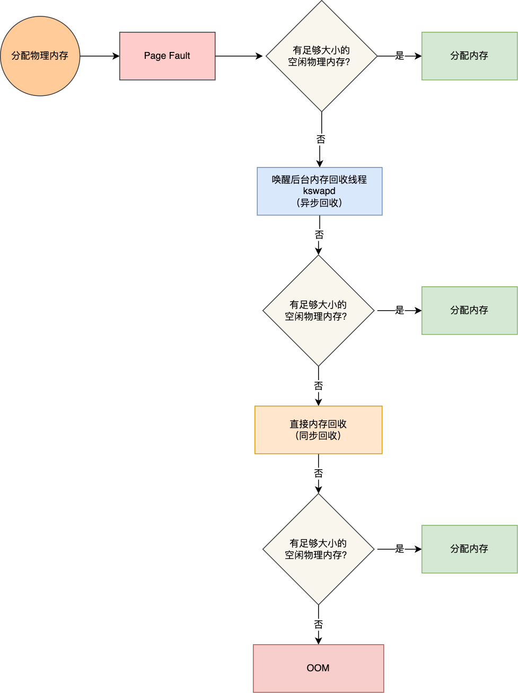

# 内存管理
## 页框管理
### 页描述符
- 作用：记录每个页框当前的状态
- 数据结构：page，所有的页描述符存放在mem_map的数组中，每个页描述符长度为32个字节，所以mem_map所需要的实际的空间略小于整个RAM的1%(1024k*4/32),利用virt_to_page(addr)产生线性地址对应的页描述符的地址，pfn_to_page(pfn)宏产生与页框号对应的页描述符地址；
- 重要成员变量：
  -  _count:页的引用计数，_count+1是当前页的引用次数
  - flags:32位描述页框状态
### 非一致内存访问(NUMA)
- 含义：该模型中，给定cpu对不同内存单元的访问时间可能是不一致的；系统的物理内存被划分为几个节点(node)，在一个节点中，给定的一组cpu访问页面所需要的时间是相同的，然而，不同组的cpu访问时间就是不同的；
- 作用：对每个cpu而言，将耗时节点的访问次数最少；
- 节点的管理：每个节点的物理内存又分为几个管理区(zone)；
- 数据结构：pg_data_t的描述符，每个节点的描述符存放在一个单向的链表，由pdgat_list变量指向；
- 说明：如果某个体系不支持NUMA,或者没有编译进内核，Linux会将整个物理内存变为一个节点；
### 内存管理区
- 体系结构的制约：体系结构有两种硬件约束，如ISA总线，物理内存大于线性内存等；
- 内存管理：将每个内存节点划分为3个管理区（zone）；在80X86 UMA体系结构中的管理区为：
  - ZONE_DMA：低于16MB的内存页框
    - 由老式的基于ISA总线的DMA设备使用
  - ZONE_NORMAL：高于16MB且低于896MB的内存框
  - ZONE_HIGHMEM：从896MB开始高于896MB的内存页框
  - ZONE_DMA和ZONE_NORMAL包含常规页框，通过它们将线性地址映射到线性地址空间的第4个GB，内核可以直接进行访问，而ZONE_HIGHMEM区中的内存页不能由内核直接访问；
- 数据结构：struct zone，该数据结构包含当前的每个区的页框状况，也记录着回收页框使用的指标，水线？管理区的很多成员变量用于描述回收页框；
- 当内核调用一个内存分配函数时，需要指明请求页框所在的管理区；
### 保留的页框池
- 由于内存分配可能失败，大多数情况下需要进入阻塞状态等待空闲页；
- 原子内存分配路径不能被则阻塞，只有分配成功和分配失败两种状态；例如，发生在处理中断或者在执行临界区的代码时；“GFP_ATOMIC”是分配时的标识flag；
- 内核为原子内存分配请求保留了一个页框池；其以KB为单位，存放在min_free_kbytes变量中，取决于直接映射到内核线性地址空间第4个GB的物理内存的数量，即包含在ZONE_DMA和ZONE_NORMAL内存管理区的页框数目；
    ```
    /proc/sys/vm/min_free_kbytes //调整pages_min
    ```
  $$保留池的大小=\lfloor \sqrt{16 \times 直接映射内存}\rfloor(KB)$$   其初始值不能小于128也不能大于65536，同时，其每个区域保留的页框数量与两个管理区的大小成正比，zone的成员变量pages_min字段保留了管理区内保留的页框的数目；其与pages_low和pages_high共同作用于内存回收；
  
- 回收内存
  - 后台内存回收(kswapd):内存回收是异步的
  - 直接内存回收(direct reclaim):内存回收是同步的
  - OOM机制(out of memory):杀进程
  ```
  /proc/[pid]/oom_score_adj //调整每个进程被杀的优先级
  ```
  
### 分区页框分配器
- 名为管理区分配器部分接受动态内存分配与释放的请求，从管理区中分配一组能满足请求的连续页框内存的管理区，每个管理区内被一个名为“伙伴系统”的部分来处理，同时，为了更好的系统性能，一小部分页框保留在cpu高速缓存中；