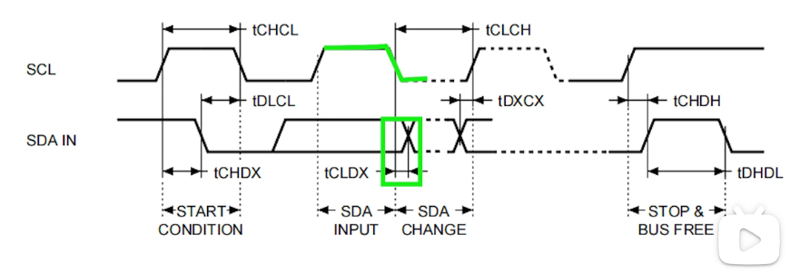
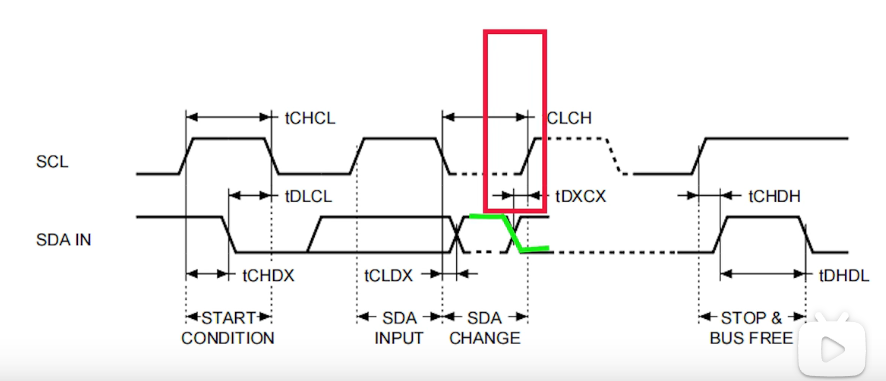
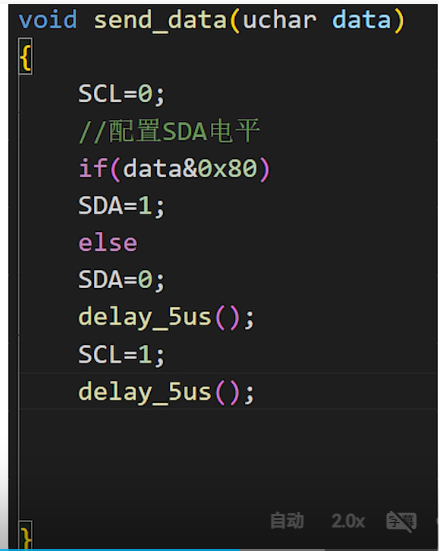

# i2c协议
## 时序图参数说明
x: 变化 c:scl d:sda h:高电平 l:低电平； 下面描述的是时钟线状态变化的时间间隔；
Tchcl: clock pluse width high 高电平持续时间,高电平多久可以变为低电平；
Tclch: clock pluse width low 低电平持续时间，低电平多久可以变为高电平；
Tcldx: clock low to input transition 低时钟到输入转换，scl变为低电平之后，经过tcldx时长才允许变化；

Tdxcx: input transition to clock transition sda的电平转换之后，经过Tdxcx的时间scl的电平才允许变化

## 代码
考虑上面的Tdxcx以及Tcldx之后，还需要考虑TCHCL和TCLCH
