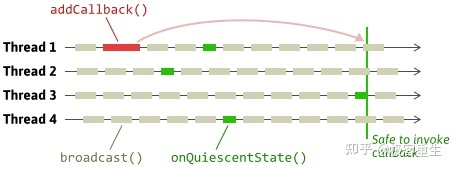

# 内核同步
## RCU
[其rcu的文章的评论说rcu的弊端，可以阅读查看](https://zhuanlan.zhihu.com/p/386422612)
核心点：
1. RCU只是保护被动态分配并通过指针引用的数据结构；
2. 在被RCU保护的临界区中，任何的内核路径都不能休眠，同时关闭了抢占；
3. 基于点2，当读者进行rcu的操作时，只需要进行关闭抢占，出临界区时，开抢占；
4. 当写者进入临界区时，也是需要关闭抢占，不然，修改了一般就被抢占了；核心在于下面的宽限期：
   
   所谓的宽限期指的是，当我将临界区保护的动态指针更新之后，到可以释放掉我的旧的内存的一段时间；如上图，当Thread1更新完毕指针之后，因为Thread2、Thread3、Thread4还在使用旧指针，所以还不能释放掉旧的内存；于是，Thread1就注册了一个回调函数，在合适的时机更新回调函数释放的对应的内存；
   基于点2，在RCU的临界区内时，任何的内核都不能休眠，同时关闭了抢占，所以，当更新之后，如果每个cpu都执行了一次调度，则其旧的指针就可以释放掉了，基于该理论，我们可以设计如下几个方案：
   1. 当reader在临界区时，我们做标记；写者进行读取复制更新；旧数据在所有的cpu都不在rcu临界区时候就可以更新调用free函数了；
