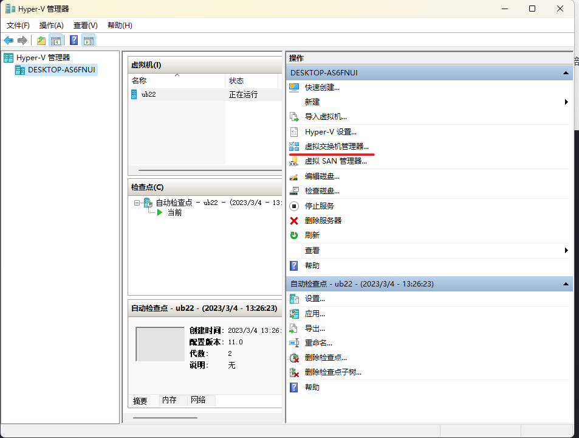

# 香橙派系列[1]:开发环境配置_ubuntu--windows下使用multipass
## 前言
orangepi-build官方介绍只能在安装有ubuntu22.04的电脑上运行，因此在下载orangepi-build之前需要首先有一个ubuntu2204的操作系统。当前本人有一台x86芯片的windows11以及m2版本的Macbook，所以使用windows11安装虚拟环境，至于为什么没有使用mac， 愿意在于本人使用mac book折腾完一遍后发现，orangepi-build的编译linux sdk脚本竟然不能在arm芯片上运行......官方说明最好不要使用windows的wsl，索性自己发现了multipass这个软件，安装ubuntu环境快的很！
## multipass的基本操作
multipass是ubuntu运营公司的项目，支持linux、windows、macOS;在不同的操作系统上使用不同的虚拟化技术。linux上使用的kvm，windows上使用的Hyper-V,MacOs上使用的是HyperKit.
### 安装 
multipass使用命令行来启动和管理ubuntu实例，[官网](https://multipass.run/install)可以快速的找到下载路径，直接就在电脑上安装成功; multipass --version 输出即可查看是否成功
### 创建一个实例
通过multipass find查找支持的版本

通过multipass launch -n name -c cpu个数 -m 内存大小 -d 硬盘大小  创建一个实例,稍等片刻，下载完毕之后即可创建成功；

通过multipass start name 以及 multipass stop name来开启、停止、删除(可recover)、释放实例，info可以显示实例信息，exec执行命令却不进入;注意下在start之后，需要使用stop停止，直接exit，实例还会继续运行，multipass list可以查看当前系统中的实例状态；

通过multipass shell name就可以进入name的实例，其为命令行显示，就可以像是普通ubuntu一样使用了；

当启动了实例之后，就可以在Hyper-V中看到实例信息了，可以对实例进行编辑操作

## multipass网络配置
新创建的实例只能和宿主机进行交互，需要配置其ip才能在外部进行ssh登录；
### 在Hyper-V中添加外部交换机设备
注意，网卡信息与当前电脑使用的网卡信息对应，选择创建外部

选择创建虚拟交换机

注意网卡信息对应,确认即可创建一个外部虚拟网卡，这个网卡就可以给我们的实例作为网卡使用

### 在实例中添加网卡
刚创建的实例只有eth0，不特殊配置其ip只能与宿主进行通信；通过eth1，可以在外部进行登录;

在window下终端可以看到对应的和eth0和etho1有关的网卡，当前的网关地址是192.168.1.1,所以我们需要将实例与我们配置的外部交换机在同一个网段下；

我们在/etc/netplan/50-cloud-init.yaml配置如下.注意配置其他的如gateway4可能会报错；然后执行sudo netplan apply使它生效；此时可以在实例内外部网络可以相互ping通；

### 开启ssh
在默认开启的实例中，没有开启ssh的操作，所以外部并不能ssh登录；
首先我们为用户添加密码；
/etc/sshd_config目录下的sshd_config文件中的下面三行语句前面的注释去掉；PermitRootLogin, StrictModes, PasswordAuthentication
然后执行命令重启ssh服务，sudo /etc/init.d/ssh restart;; 执行完毕之后，我们就可以通过外部的ssh连接到实例;

## multipass图形服务
在实例下执行sudo apt intall ubuntu-desktop xrdp -y为实例安装桌面服务
在另一台电脑或者宿主电脑中，我们需要一个远程桌面软件，在windows下的远程连接，在mac下需要使用Microsoft Remote Desktop

通过远程桌面连接就可以使用桌面环境了！

